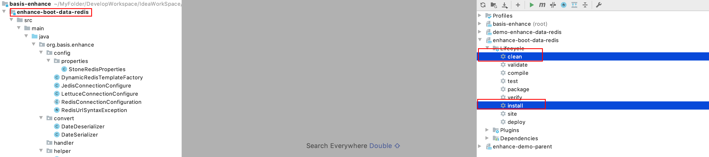
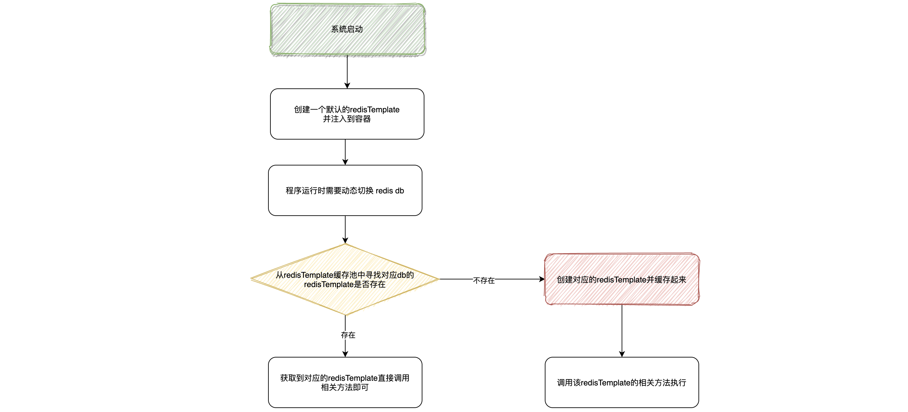

## 一、功能介绍及如何使用
### 1、功能简介
该模块是基于spring-boot-starter-data-redis（spring-boot-starter-parent版本2.4.8），并且对spring-boot-starter-data-redis模块部分功能增强，
提供动态切换redis db功能，以及一些Redis操作常用帮助器。

### 2、下载源码打包到自己的maven仓库

mvn clean install



### 3、pom中引入该项目依赖

```xml
<dependency>
  <groupId>org.basis.enhance</groupId>
	<artifactId>enhance-boot-data-redis</artifactId>
  <!-- 排除lettuce依赖，data-redis默认选择lettuce -->
  <!--<exclusions>-->
  <!--  <exclusion>-->
  <!--    <groupId>io.lettuce</groupId>-->
  <!--    <artifactId>lettuce-core</artifactId>-->
  <!--  </exclusion>-->
  <!--</exclusions>-->
  <version>1.0-SNAPSHOT</version>
</dependency>
<!--如果redis客户端需要使用jedis，pom文件里需要引入jedis的依赖，并排除lettuce依赖-->
<!--
<dependency>
  <groupId>redis.clients</groupId>
  <artifactId>jedis</artifactId>
  <version>3.3.0</version>
</dependency>
-->
```

### 4、application.yml配置文件中开启动态切换redis db

```yml
spring:
	# redis基本信息配置
  redis:
    host: ${SPRING_REDIS_HOST:wenpan-host}
    port: ${SPRING_REDIS_PORT:6379}
    password: ${SPRING_REDIS_PASSWORD:xxx}
    database: ${SPRING_REDIS_DATABASE:1}
    # redis客户单默认使用lettuce，可自己切换为jedis
    client-type: lettuce
    lettuce:
      pool:
        # 资源池中最大连接数
        # 默认8，-1表示无限制；可根据服务并发redis情况及服务端的支持上限调整
        max-active: ${SPRING_REDIS_POOL_MAX_ACTIVE:16}
        # 资源池运行最大空闲的连接数
        # 默认8，-1表示无限制；可根据服务并发redis情况及服务端的支持上限调整，
        # 一般建议和max-active保持一致，避免资源伸缩带来的开销
        max-idle: ${SPRING_REDIS_POOL_MAX_IDLE:16}
        # 当资源池连接用尽后，调用者的最大等待时间(单位为毫秒)
        # 默认 -1 表示永不超时，设置5秒
        max-wait: ${SPRING_REDIS_POOL_MAX_WAIT:5000}
    jedis:
      pool:
        max-active: ${SPRING_REDIS_POOL_MAX_ACTIVE:16}
        max-idle: ${SPRING_REDIS_POOL_MAX_IDLE:16}
        max-wait: ${SPRING_REDIS_POOL_MAX_WAIT:5000}
stone:
  redis:
  	# 开启动态切换redis db
    dynamic-database: true
```

### 5、使用

在RedisHelper对Redis的常用操作做了封装，如果是使用的常见方法，则直接调用RedisHelper中的相关方法即可，使用上非常的方便。

#### ①、使用redisHelper封装的api操作指定db

```java
@Slf4j
@RestController("TestEncryptController.v1")
@RequestMapping("/v1/test-enhance-redis")
public class TestEnhanceDataRedisController {

    @Autowired
    @Qualifier("redisHelper")
    private RedisHelper redisHelper;
    
    public void testChangeDb() {
      // 设置当前线程需要将数据写入到几号db
      redisHelper.setCurrentDatabase(2);
      // 写到2号库(这里调用自己封装的方法，如果要使用原生的方法并写入自定义db，后面介绍)
      redisHelper.strSet("dynamic-key-test-1", "value-1");
      // 清除当前线程所使用的db信息
      redisHelper.clearCurrentDatabase();
    }
}
```

#### ②、使用原生的RedisTemplate的api操作指定db

如果提供的RedisHelper的封装方法中没有你想要使用的方法，你想要调用原生的redisTemplate的方法，并且实现自定义db写入，那么怎么办呢？直接调用`redisHelper.getRedisTemplate()`即可获取RedisTemplate，然后进行操作即可。

```java
@Slf4j
@RestController("TestEncryptController.v1")
@RequestMapping("/v1/test-enhance-redis")
public class TestEnhanceDataRedisController {

    @Autowired
    @Qualifier("redisHelper")
    private RedisHelper redisHelper;
    
    public void testChangeDb() {
      // 设置当前线程需要将数据写入到几号db
      redisHelper.setCurrentDatabase(2);
      // 使用原生的方法并写入自定义db
      RedisTemplate<String, String> redisTemplate = redisHelper.getRedisTemplate();
      redisTemplate.opsForValue().set("key","value");
      // 清除当前线程所使用的db信息
      redisHelper.clearCurrentDatabase();
    }
}
```

#### ③、更简单的使用

上面的使用可能你觉得有点麻烦，每次都要手动的去set db 和清除db，那么能不能省去这两部操作更简单的使用呢？可以的，直接通过提供的`EasyRedisHelper`来操作即可，`EasyRedisHelper`提供多种便捷使用的方式，这里以一种举例。

##### 1、指定操作db，使用redisHelper封装的api

```java
@Slf4j
@RestController("TestEncryptController.v1")
@RequestMapping("/v1/test-enhance-redis")
public class TestEnhanceDataRedisController {

    @Autowired
    @Qualifier("redisHelper")
    private RedisHelper redisHelper;
    
    @GetMapping("/test-")
    public void testChangeDb6() {
        // 指定操作库，不带返回值的操作，使用redisHelper封装的api
        EasyRedisHelper.execute(2, () -> redisHelper.lstLeftPush("key", "value"));
        // 指定操作库，带返回值的操作，使用redisHelper封装的api
        String result = EasyRedisHelper.executeWithResult(2, () -> redisHelper.strGet("dynamic-key-test-2"));
    }
}
```

##### 2、指定操作db，使用redisTemplate原生的api

```java
@Slf4j
@RestController("TestEncryptController.v1")
@RequestMapping("/v1/test-enhance-redis")
public class TestEnhanceDataRedisController {

    @Autowired
    @Qualifier("redisHelper")
    private RedisHelper redisHelper;
    
    @GetMapping("/test-7")
    public void testChangeDb7() {
      	// 指定操作库，不带返回值的操作，使用redisTemplate原生api
        EasyRedisHelper.execute(1, (redisTemplate) -> redisTemplate.opsForList().leftPush("key", "value"));
        // 指定操作库，带返回值的操作，使用redisTemplate原生api
        String result = EasyRedisHelper.executeWithResult(1, 
                     (redisTemplate) -> redisTemplate.opsForList().leftPop("queue"));
    }
}
```

#### ④、其他使用

该增强组件中提供了其他的对redis的相关操作的工具类封装，可参考源代码自由使用！

## 二、特点分析

1. 该增强组件是对于每个`redis db`创建一个`redisTemplate`并缓存起来，在使用的时候通过db值来动态的选取对应的`redisTemplate`来进行调用对应的方法，不会有安全性问题。

2. `redisTemplate`创建的时候使用类似懒加载的方式，项目启动时并不会创建多个redis连接工厂，当需要动态切换redis db的时候如果不存在对该db的`redisTemplate`则才去创建`redisTemplate`并缓存起来，不会有太大的连接开销和性能损耗。

3. 创建redisTemplate需要构建redisConnectionFactory、lettuce连接配置或jedis连接配置，这些配置的创建是一个十分复杂且麻烦的事情，我们采用了和源码相同的创建方式，仅仅对`spring-boot-starter-data-redis`中创建`LettuceConnectionConfigure`、`JedisConnectionConfigure`、`redisConnectionFactory`做了自定义更改。所以原则上还是使用的`spring-boot-data-redis`构建redisTemplate的原流程进行redisTemplate的构建，所以构建的redisTemplate一般不会有隐藏bug。

4. 该增强组件支持jedis和lettuce客户端和`spring-boot-starter-data-redis`保持一致，且默认是使用lettuce客户端的，用户可以无感知的切换到jedis客户端。

5. 支持的Redis部署模式和`spring-boot-starter-data-redis`保持一致（可支持单机版、集群模式、哨兵模式）

6. 该增强组件默认为容器注入`RedisTemplate`和`StringRedisTemplate`两个template，且这两个template使用的key-value序列化方式都是使用`stringRedisSerializer`。使用者直接注入这俩template即可使用。如果使用者想采用自己定义的key-value序列化器来创建template，那么只需要自己在配置文件中使用`@Bean`的方式注入自定义的RedisTemplate即可覆盖默认提供的RedisTemplate（即有用户配置的RedisTemplate则优先使用用户配置的RedisTemplate，如果没有则使用组件默认提供的RedisTemplate）。

7. 创建动态RedisTemplate的时候目前创建的RedisTemplate的key-value序列化器默认使用的是`stringRedisSerializer`，这里以后应该实现成用于动态可配置。

## 三、实现原理

这里只介绍整个流程实现的核心原理，具体实现细节忽略！！！

### ①、初始想法

1. 从原理上讲很简单，首先我们要操作不同的db，且该db要由用户动态可指定，我们知道RedisTemplate在创建的时候默认使用的是用户在application.yml中使用`database`指定的db，如下

   ```yml
   spring:
     redis:
       host: ${SPRING_REDIS_HOST:wenpan-host}
       port: ${SPRING_REDIS_PORT:6379}
       password: ${SPRING_REDIS_PASSWORD:WenPan@123}
       # 指定使用Redis几号库
       database: ${SPRING_REDIS_DATABASE:1}
   ```

2. 那么要更改所使用的db就意味着在使用的时候要更改RedisTemplate连接，使原本连向1号库的RedisTemplate重新和redis进行连接，所以最开始我考虑了如下方案

   - 在用户动态切换db的时候通过redisConnectionFactory重新连接redis到指定的库上
   - 使用完毕后再切换回来

3. 如果使用上面的第二步，那么会有很大问题

   - 首先来回的切换db，不断的重连redis当并发稍微一大的时候就会对Redis连接造成很大冲击
   - 并且频繁的创建和关闭连接也会十分消耗系统性能
   - 在并发多线程情况下不断的重置连接会有数据安全性问题，可能导致A线程使用了B线程的库
   - 所以此方案需要改进

### ②、方案改进

1. 既然使用一个`RedisTemplate`的办法行不通，那么可不可以考虑使用多个RedisTemplate呢（懒创建）？对于每个库我都通过`redisConnectionFactory`去创建一个连接和一个对应的`RedisTemplate`，并且缓存起来。
2. 当需要使用到某个db的时候，只需要按一定规则动态的取出和这个db对应的RedisTemplate，然后基于该RedisTemplate进行操作即可。
3. 因为从缓存中取出的RedisTemplate连向的是对应的redis db，所以这样就避免了频繁的切换db是不断的重置redis连接造成的性能损耗问题和多线程下的安全性问题。
4. 每个db 对应的RedisTemplate都是使用到的时候才进行创建（类似懒加载的道理），不会在系统启动时全部创建。减少系统压力

### ③、整体流程



## 四、核心源代码介绍

[java实现redis动态切换db](https://blog.csdn.net/Hellowenpan/article/details/119643657)


