## 一、项目功能说明

该工程（`enhance-boot-groovy-engine`）主要是利用【`springboot + groovy`】对groovy动态加载脚本功能进行了封装和集成，使得在springboot项目中能够更加简单方便的使用groovy在不重启的情况下来动态的加载外部脚本，可以看做是一个基于groovy封装的轻量级【规则引擎】。

### 1、为什么选择groovy

- 在实际的平台化项目中，为了提升平台抽象能力使用更多场景，引入了规则引擎。如一个用户购买了500元商品可以获得10元红包，异或是购买了指定会场商品获取50元优惠券等。在不通互动场景中活动的规则是不同的，如果通过JAVA去实现，每次有新的规则要求，都要发布一次，这样成本就太高了。
- 如果项目里只需要使用到轻量级的规则脚本，那么此时去引入像Drools这样的重量级规则引擎，那么有些杀鸡用牛刀的感觉。
- groovy对Java的支持性非常好，完全可以使用Java语法去编写groovy脚本，对于Java开发者来说几乎没有学习成本。

### 2、项目结构

- 项目大体分为两部分，core部分代表了功能的核心实现，loader部分代表了对脚本来源的扩展支持从不同来源加载脚本
- `demo-enhance-groovy-engine`中是对该项目的一些使用demo

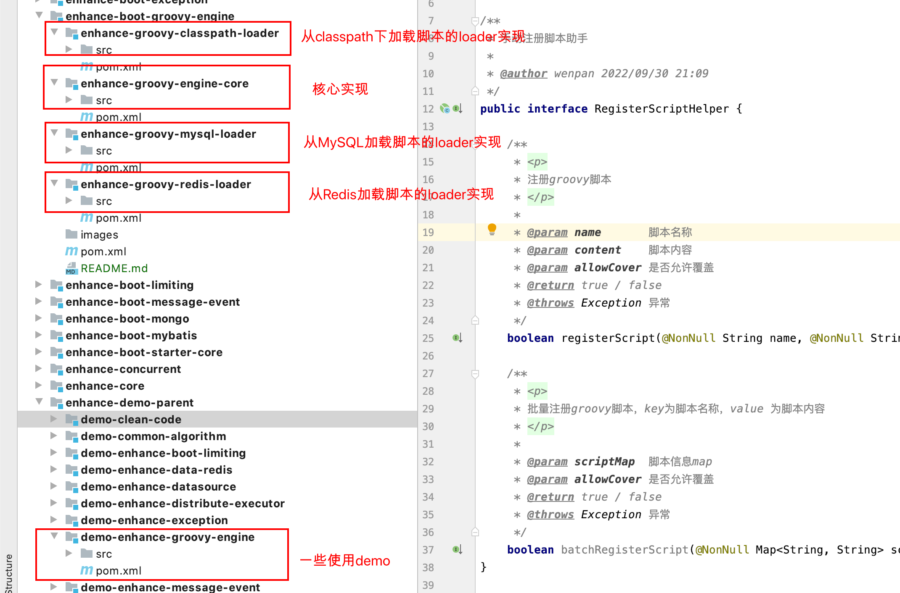

### 3、项目特点

- 基于springboot来整合的groovy，使用者仅需要引入【maven坐标】，配置好【`application.yml`】参数即可方便使用
- 提供了【从classpath下加载脚本】、【从Redis加载脚本】、【从MySQL数据库加载脚本】这三种脚本来源选项，脚本加载源可以方便的替换（仅需要更改application.yml配置即可）
- 使用【`GroovyClassLoader + InvokerHelper` + 缓存parse好的Class对象】来解决频繁load groovy脚本为Class从而导致方法区OOM问题。同时通过缓存脚本信息来避免每次执行脚本都需要重新编译而带来的性能消耗，保证脚本执行的高效。
- 提供`EngineExecutor`方便的来执行脚本，同时提供多种执行脚本的方式，仅需要传入能定位脚本的唯一key和脚本里需要的参数即可方便的调用指定的脚本进行执行了
- 项目中提供了非常多的【可配置项】以及【可替换组件】，使用方可以根据项目需要调整配置项参数值，也可以自己实现某一个组件，然后注册到容器中，进而替换原有组件。
- 项目中使用【`caffeine`】来缓存脚本项，并设置过期时间，并且项目里提供了定时刷新（刷新间隔周期可配置）本地缓存里的脚本项的异步线程，可以及时的将【本地缓存的脚本项】和【数据源中的脚本项】进行对比，一旦发现数据源中的脚本发生了变更则及时刷新本地缓存中的脚本项，并且替换原脚本对应的Class。
- 项目中提供了很多xxxxxHelper，这些helper将本项目的核心功能进行透出，使用方可以通过这些helper来进行定制化操作
  - 【`ApplicationContextHelper`】提供了操作spring容器的一些功能，可以借助该helper方便的对IOC容器进行操作
  - 【`RefreshScriptHelper`】提供了动态刷新本地内存中的脚本的能力，可以通过该helper提供的方法来手动的刷新本地内存的脚本（支持单个刷新和批量刷新），比如：新增或修改了某个脚本后想立即让该脚本生效。
  - 【`RegisterScriptHelper`】提供了动态向数据源和本地缓存里注册脚本的能力，可以通过该helper来动态的向数据源和本地缓存中修改脚本或注册新的groovy脚本
- 项目中使用caffeine缓存来缓存脚本，指定了最大缓存的脚本条数（可配置），当脚本条数达到最大缓存条数后通过淘汰算法淘汰不常用的脚本，以保证不会因为加载过多脚本导致内存占用过高。并且可以配置缓存条目的有效期，可以淘汰失效的或者长时间不用的脚本项，当再次使用到时再从数据源加载脚本并缓存。
- 项目提供的能力需要在application.yml中通过配置开启，如果引入了本项目的maven依赖，但是没有在application.yml中显示开启功能，那么本项目的功能不会生效。
- 脚本动态刷新部分参考zuul网关的filter源码进行编写

## 二、开启配置

### 1、下载源码并打包到自己的maven仓库

源码地址：[https://gitee.com/mr_wenpan/basis-enhance/blob/master/enhance-boot-data-redis/README.md](https://gitee.com/mr_wenpan/basis-enhance/blob/master/enhance-boot-data-redis/README.md)

执行命令：`mvn clean install`（需要切换到该项目目录下执行）

### 2、pom中引入依赖坐标

**==特别说明==**：

- 【`enhance-groovy-engine-core`】是核心依赖，必须要引入，其他的按需求选配即可。
- 如果是从classpath下加载脚本，那么只需要引入【`enhance-groovy-classpath-loader`】即可
- 如果是从redis中加载脚本，那么需要引入【`enhance-groovy-redis-loader`】，由于是从Redis中读取脚本，所以Redis的核心依赖不能少【`spring-boot-starter-data-redis`】和 【`commons-pool2`】（如果项目中已经有Redis了，那可以不引入这两个）
- 如果是从MySQL中加载脚本，那么需要引入【`enhance-groovy-mysql-loader`】以及连接MySQL所需要的的依赖

```xml
<!--核心依赖-->
<dependency>
  <artifactId>enhance-groovy-engine-core</artifactId>
  <groupId>org.basis.enhance</groupId>
  <version>1.0-SNAPSHOT</version>
</dependency>

<!--++++++++++++++++++++++++++++++++以下三种loader，按需选配即可++++++++++++++++++++++++++++++++-->

<!--++++++++++++++++++++++++++++++++++第一种:基于Redis的loader++++++++++++++++++++++++++++++++++-->
 <!--加载Redis下的groovy脚本loader依赖-->
<dependency>
  <artifactId>enhance-groovy-redis-loader</artifactId>
  <groupId>org.basis.enhance</groupId>
  <version>1.0-SNAPSHOT</version>
</dependency>
<!--redis核心依赖-->
<dependency>
  <groupId>org.springframework.boot</groupId>
  <artifactId>spring-boot-starter-data-redis</artifactId>
</dependency>
<!--Apache的 common-pool2(至少是2.2)提供连接池,供redis客户端使用-->
<dependency>
  <groupId>org.apache.commons</groupId>
  <artifactId>commons-pool2</artifactId>
</dependency>

<!--++++++++++++++++++++++++++++++++++第二种:基于Classpath的loader++++++++++++++++++++++++++++++++++-->
<!--加载classpath下的groovy脚本loader依赖-->
<dependency>
  <artifactId>enhance-groovy-classpath-loader</artifactId>
  <groupId>org.basis.enhance</groupId>
  <version>1.0-SNAPSHOT</version>
</dependency>

<!--++++++++++++++++++++++++++++++++++第三种:基于MySQL的loader++++++++++++++++++++++++++++++++++-->
<!--加载MySQL下的groovy脚本loader依赖-->
<dependency>
  <artifactId>enhance-groovy-mysql-loader</artifactId>
  <groupId>org.basis.enhance</groupId>
  <version>1.0-SNAPSHOT</version>
</dependency>
<!--以下是mysql相关依赖-->
<dependency>
  <groupId>org.springframework</groupId>
  <artifactId>spring-jdbc</artifactId>
</dependency>
<dependency>
  <groupId>mysql</groupId>
  <artifactId>mysql-connector-java</artifactId>
</dependency>
<dependency>
  <groupId>com.zaxxer</groupId>
  <artifactId>HikariCP</artifactId>
</dependency>
<!--mybatis依赖-->
<dependency>
  <groupId>org.mybatis.spring.boot</groupId>
  <artifactId>mybatis-spring-boot-starter</artifactId>
  <version>2.0.1</version>
</dependency>
```

### 3、配置application.yml

==**以下以从Redis加载脚本为例来演示配置**==

```yml
server:
  port: 1234

spring:
  application:
    name: customer-console
  # redis基础配置
  redis:
    host: ${SPRING_REDIS_HOST:xxx-host}
    port: ${SPRING_REDIS_PORT:6379}
    password: ${SPRING_REDIS_PASSWORD:xxxx@123}
    database: ${SPRING_REDIS_DATABASE:2}

enhance:
  groovy:
    engine:
      # 脚本检查更新周期（单位：秒），（默认300L）
      pollingCycle: 10
      # 开启功能
      enable: true
      # 缓存过期时间(默认600L分钟)
      cacheExpireAfterWrite: 10
      #缓存初始容量(默认100)
      cacheInitialCapacity: 10
      # 缓存最大容量(默认500)
      cacheMaximumSize: 20
      # 开启基于Redis加载groovy脚本
      redis-loader:
        # 命名空间，可以和应用名称保持一致即可，主要是为了区分不同的应用
      	namespace: customer-console
      	# 开启基于Redis的loader
      	enable: true
```

## 三、使用介绍

### 1、Redis中导入groovy脚本

- 当然你也可以项目启动好后通过`RegisterScriptHelper`来注册脚本，这里采用预先加载好脚本到Redis来演示
- 对应的脚本都在`org.enhance.groovy.infra.groovy`目录下，自己按需设定脚本key即可


#### ①、脚本内容

- key:  customer-console
- hashKey: change-order
- 脚本：

```groovy
package org.enhance.groovy.api.dto


import org.slf4j.Logger
import org.slf4j.LoggerFactory

class ChangeOrderInfo extends Script {

    private final Logger logger = LoggerFactory.getLogger(getClass());

    @Override
    Object run() {
        // 调用方法
        changeOrderInfo();
    }

    // 修改订单信息
    OrderInfoDTO changeOrderInfo() {
        String newOrderAmount = "20000";
        // 获取参数
        OrderInfoDTO orderInfoDTO = orderInfo;
        logger.info("即将修改订单金额，原金额为：{}, 修改后的金额为：{}", orderInfoDTO.getOrderAmount(), newOrderAmount);
        orderInfoDTO.setOrderAmount("2000");
        // 返回修改后的结果
        return orderInfoDTO;
    }
}
```

- key:  customer-console
- hashKey: change-product
- 脚本：

```groovy
package org.enhance.groovy.api.dto

import org.basis.enhance.groovy.entity.ExecuteParams
import org.slf4j.Logger
import org.slf4j.LoggerFactory

class ChangeProductInfo extends Script {

    private final Logger logger = LoggerFactory.getLogger(getClass());

    // 修改商品信息
    ProductInfoDTO changeProduct(ExecuteParams executeParams) {
        // 获取product对象
        ProductInfoDTO productInfo = (ProductInfoDTO) executeParams.get("productInfo");
        Double newOrderAmount = 20000D;
        logger.info("即将修改商品金额，原金额为：{}, 修改后的金额为：{}", productInfo.getPrice(), newOrderAmount);
        // 商品价格修改为newOrderAmount
        productInfo.setPrice(newOrderAmount);
        // 返回修改后的对象
        return productInfo;
    }

    @Override
    Object run() {
        return null
    }
}
```

- key:  customer-console
- hashKey: get-context
- 脚本：

```groovy
package org.enhance.groovy.infra.groovy

import org.enhance.groovy.api.dto.ProductInfoDTO
import org.enhance.groovy.app.service.ProductService
import org.slf4j.Logger
import org.slf4j.LoggerFactory
import org.springframework.context.ApplicationContext

/**测试从spring ioc容器中获取bean，并调用bean的方法*/
class GetApplicationContext extends Script {

    private final Logger logger = LoggerFactory.getLogger(getClass());

    @Override
    Object run() {
        // 调用方法
        ApplicationContext context = getContext();
        // 获取容器中的bean
        ProductService productService = context.getBean(ProductService.class);
        // 调用bean的方法
        Random random = new Random();
        ProductInfoDTO productInfoDTO = productService.getProductById(random.nextInt(1000));
        logger.info("productInfoDTO is : {}", productInfoDTO);

        // 调用bean 的修改方法
        productService.updateProduct(productInfoDTO);
        logger.info("updated productInfoDTO is : {}", productInfoDTO);
        return productInfoDTO;
    }

    // 获取spring容器
    ApplicationContext getContext() {
        // 获取spring IOC容器
        ApplicationContext context = applicationContext;
        return context;
    }
}
```

### 2、启动项目并调用脚本

- 项目启动好后直接访问：[http://localhost:1234/v1/load-from-redis/change-order?scriptName=change-order](http://localhost:1234/v1/load-from-redis/change-order?scriptName=change-order)即可
- 观察控制台，可以看到orderAmount已经被脚本动态修改了

```java
   /**
     * scriptName只要能唯一定位到脚本即可
     * 测试{@link EngineExecutor#execute(ScriptQuery, ExecuteParams)}
     * 请求URL：http://localhost:1234/v1/load-from-redis/change-order?scriptName=change-order
     */
    @GetMapping("/change-order")
    public String changeOrderInfo(String scriptName) {
        // 构建参数
        OrderInfoDTO orderInfoDTO = new OrderInfoDTO();
        orderInfoDTO.setOrderAmount("1000");
        orderInfoDTO.setOrderName("测试订单");
        orderInfoDTO.setOrderNumber("BG-123987");
        ExecuteParams executeParams = new ExecuteParams();
        executeParams.put("orderInfo", orderInfoDTO);

        // 执行脚本
        EngineExecutorResult executorResult = engineExecutor.execute(new ScriptQuery(scriptName), executeParams);
        String statusCode = executorResult.getExecutionStatus().getCode();
        if("200".equals(statusCode)){
            log.info("脚本执行成功......");
        } else {
            log.info("脚本执行失败......");
        }
        log.info("changeOrderInfo=========>>>>>>>>>>>执行结果：{}", executorResult);

        return "success";
    }
```

## 四、压测对比

### 1、压测条件

- 由于资源条件优先，受本机条件限制以及其他影响，给出如下大致压测配置
  - 应用程序JVM配置：-Xms400m -Xmx400m -XX:+HeapDumpOnOutOfMemoryError 
  - 压测工具：jmeter
  - 线程数量：10
  - ramp up时间：20秒
  - 每个线程循环次数：10000次
  - 总共样本量：100000次
- 本机条件限制，压测结果不一定完全正确，可以做一个大致参考！

### 2、先看本机一个不用脚本的简单程序压测结果

- 可以看到10w次请求，吞吐量大约在4947（记住这个数字，后续和我们使用缓存脚本的执行时间进行比较）
- 测试用例见：`org.enhance.groovy.api.controller.TestPerformanceController#simpleTest`

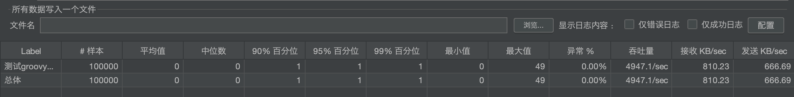

### 3、每次都编译脚本为Class

- 由于吞吐量实在太低了，所以这里只压了10000次（预热过后）
- 可以看到吞吐量在117左右，并且有0.09%的异常量，如果持续压测可能吞吐量更低
- 测试用例见：`org.enhance.groovy.api.controller.TestPerformanceController#testCompileDirect`

#### ①、吞吐量

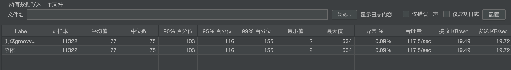

#### ②、方法区使用和类加载情况总览

- 可以看到即使我们每次都编译脚本然后再执行，方法区的Class数量也不会猛增，而是方法区大小维持在54M左右，这是为啥呢？
  - 因为在代码里我使用了自定义的【`GroovyCompiler`】，==**每次加载脚本为Class时都会使用新的类加载器（便于回收），当某个Class不在被引用并且不在有任何对象存活并且他的classLoader已经回收时，该Class也会相应的被回收掉**==。所以即便是每次都编译脚本执行也不会导致方法区Class对象不断增加。
  - 如果所有动态编译的Class都使用同一个 【`ClassLoader`】来加载，那么ClassLoader持有着该Class的引用，只要该ClassLoader没有被回收，那么所有由该【`ClassLoader`】加载的Class也无法完成回收，那么就会导致方法区中Class越来越多，进而导致方法区OOM。
- **问题**：如果每次编译脚本都使用同一个【`GroovyClassLoader`】对象（**注意这里是同一个GroovyClassLoader对象，而不是其他ClassLoader**），那么方法区的Class个数会不会持续上升呢？方法区内存会不会持续上升呢？**==看后面的验证！！！==**
- 详情参考：`org.basis.enhance.groovy.compiler.impl.GroovyCompiler`

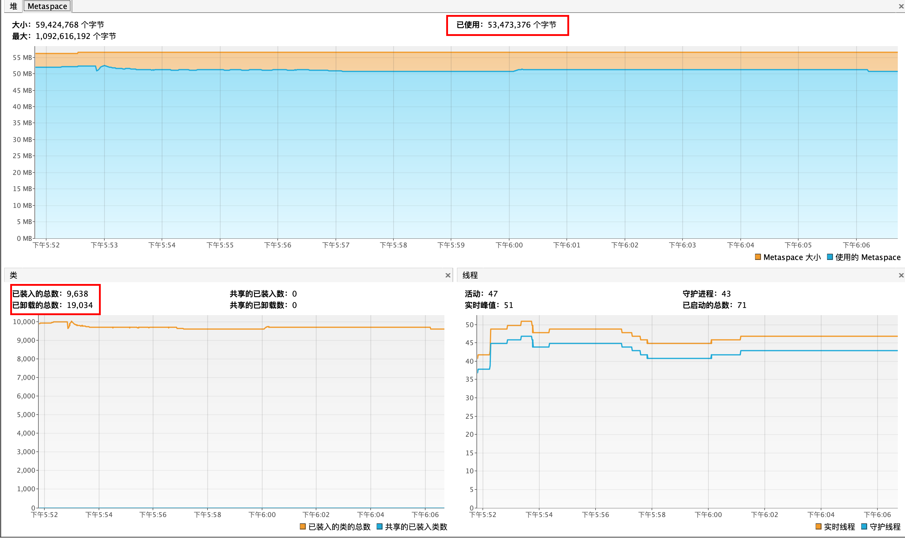

#### ③、方法区使用情况

- 可以看到方法区几乎维持不变，说明动态加载的一个个脚本Class都已经被及时回收了，原因见👆🏻的分析

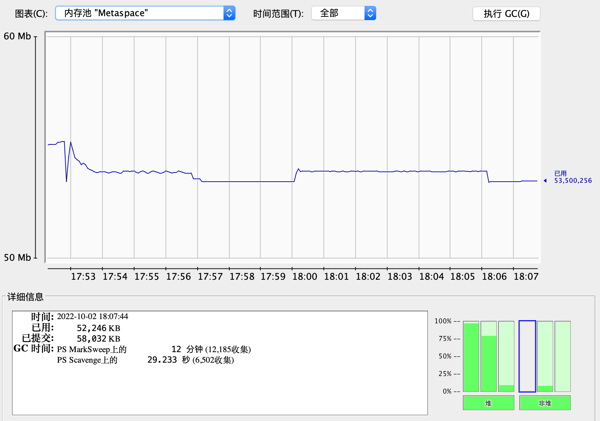

#### ④、加载的类情况

- 可以看到JVM中【加载的类总数】越来越多（每编译一次脚本就会新增一个Class到方法区），但是内存中类的个数并没有太大的变化（因为没用的Class可以及时被卸载了）
- 对于这种情况，虽然上面我们通过每个Class使用不同的ClassLoader来避免了方法区Class过多，从而导致OOM，但是这种不断的新增Class到方法区，然后从方法区不断的卸载Class，这对JVM来说也不是一件高效的事儿。并且方法区属于堆外内存，申请和释放的效率不像JVM堆内存一样高效。所以我们也应该尽量避免不断地创建Class和回收Class的情况（可以通过下面的缓存Class手段来避免）。

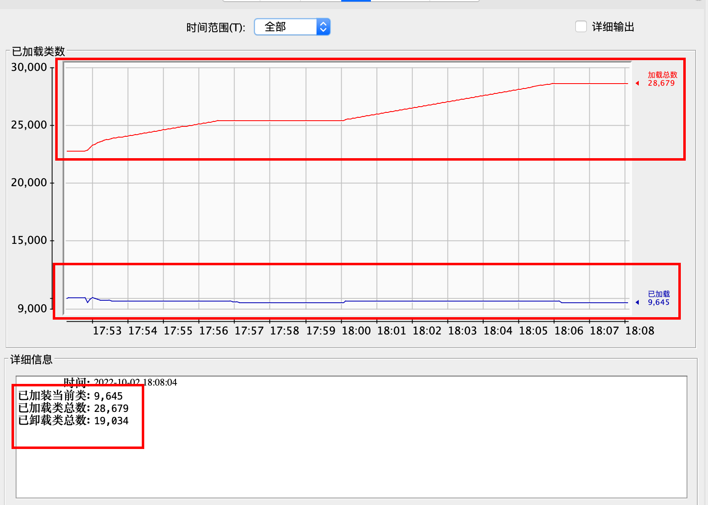

### 4、使用缓存编译后的脚本Class

#### ①、吞吐量

- 可以看到吞吐量在4661左右，确实比【每次都编译脚本为Class】吞吐量高了上百倍
- 可以和上面的简单接口压测结果（吞吐量为4947）比对，可见同样进行10w次请求，缓存编译后的脚本Class方案性能并没有逊色许多，可以说是非常高效了
- 测试用例见：`org.enhance.groovy.api.controller.TestPerformanceController#userCache`

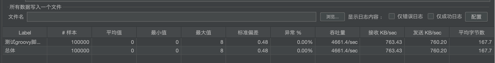

#### ②、方法区使用和类加载情况总览

- 可以看到方法区内存维持在54M左右，没有太大的变化
- 装载的类的数量也维持在15721左右，比较平稳，没有频繁的装载Class到方法区
- 整体曲线都比较平滑，没有很大的起伏。

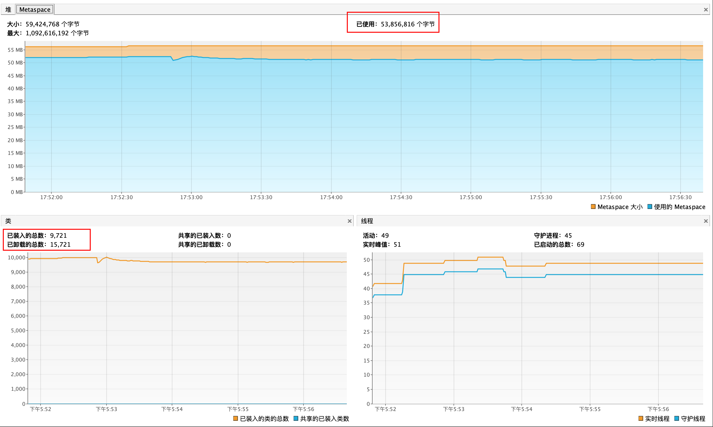

#### ③、方法区使用情况

- 可以看到【方法区】的内存使用量保持得比较平稳，基本都在53 ~ 54M之间，说明方法区中没有进行持续的大量的加载类并且无法卸载的情况

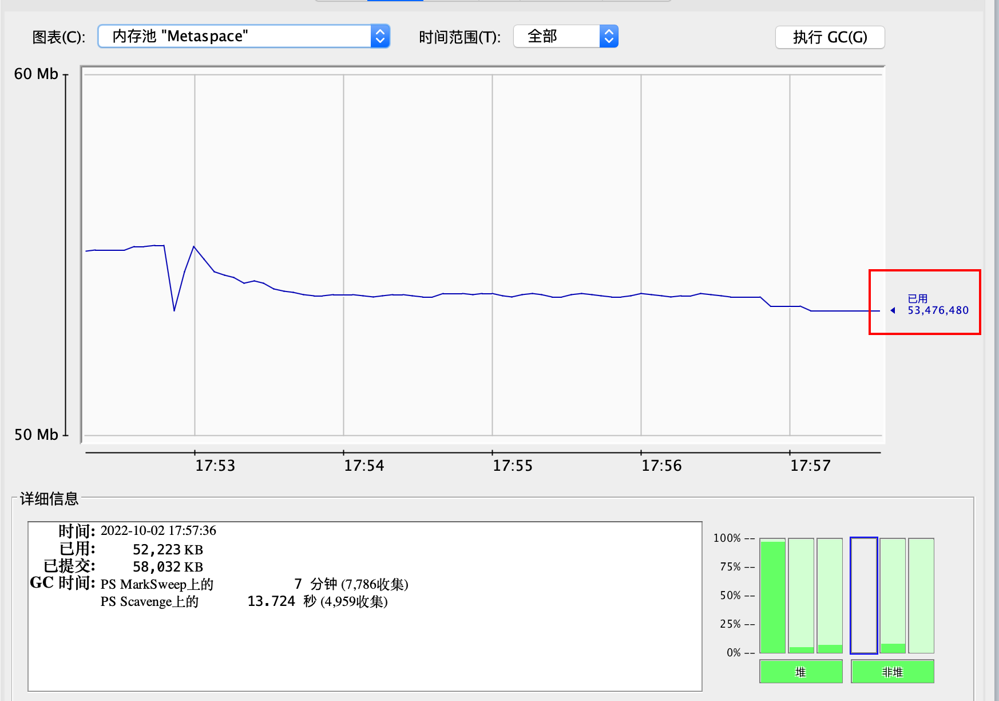

#### ④、加载的类情况

- 可以看到方法区加载的类总数平稳的位置在25446左右，没有随着执行时间增加而增加

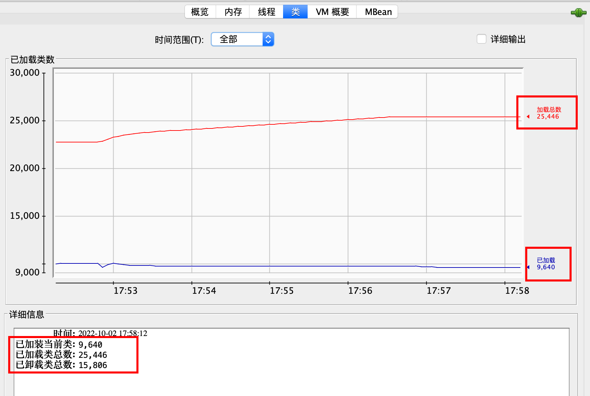

## 五、其他

- 项目提供了很好的扩展点，如果项目提供的loader不适合某些应用场景，可以通过实现【`ScriptLoader`】接口来自定义脚本加载源（比如：从MongoDB加载脚本、从Oracle加载脚本等）

- 几乎每个组件都是可以动态替换的，如果有组件不满足需求，那么使用方可以自己实现对应的接口覆写方法，然后注入容器即可替换原有组件。

- 如果要使用【`enhance-groovy-mysql-loader`】从MySQL加载脚本，那么需要新建一张脚本存放表，建表SQL如下：

  ```sql
  SET NAMES utf8mb4;
  SET FOREIGN_KEY_CHECKS = 0;
  
  -- ----------------------------
  -- Table structure for enhance_groovy_script
  -- ----------------------------
  DROP TABLE IF EXISTS `enhance_groovy_script`;
  CREATE TABLE `enhance_groovy_script` (
    `id` bigint NOT NULL COMMENT '主键id',
    `namespace` varchar(128) NOT NULL COMMENT '命名空间',
    `platform_code` varchar(128) NOT NULL COMMENT '平台码',
    `product_code` varchar(128) NOT NULL COMMENT '产品码',
    `channel_code` varchar(128) NOT NULL COMMENT '渠道码',
    `business_code` varchar(128) NOT NULL COMMENT '业务码',
    `enable` tinyint(1) NOT NULL DEFAULT '0' COMMENT '是否启用',
    `script_content` longtext NOT NULL COMMENT '脚本内容',
    `extend_info` longtext COMMENT '扩展信息',
    `talent` varchar(64) NOT NULL DEFAULT 'unknown' COMMENT '租户编码',
    `object_version_number` int NOT NULL DEFAULT '0' COMMENT '版本号',
    `creation_date` datetime NOT NULL DEFAULT CURRENT_TIMESTAMP ON UPDATE CURRENT_TIMESTAMP COMMENT '创建日期',
    `latest_modified_date` datetime NOT NULL DEFAULT CURRENT_TIMESTAMP ON UPDATE CURRENT_TIMESTAMP COMMENT '最后修改日期',
    PRIMARY KEY (`id`),
    UNIQUE KEY `idx_only_key` (`namespace`,`platform_code`,`product_code`,`channel_code`,`business_code`) USING BTREE COMMENT '唯一索引'
  ) ENGINE=InnoDB DEFAULT CHARSET=utf8mb4 COLLATE=utf8mb4_0900_ai_ci;
  
  -- ----------------------------
  -- Records of enhance_groovy_script
  -- ----------------------------
  BEGIN;
  INSERT INTO `enhance_groovy_script` VALUES (1, 'customer-console', 'console-manager', 'enhance', 'test', 'change-product', 1, 'package org.enhance.groovy.api.dto \n\nimport org.basis.enhance.groovy.entity.ExecuteParams\nimport org.slf4j.Logger\nimport org.slf4j.LoggerFactory\n\nclass ChangeProductInfo extends Script {\n\n    private final Logger logger = LoggerFactory.getLogger(getClass());\n\n    // 修改商品信息\n    ProductInfoDTO changeProduct(ExecuteParams executeParams) {\n        // 获取product对象\n        ProductInfoDTO productInfo = (ProductInfoDTO) executeParams.get(\"productInfo\");\n        Double newOrderAmount = 20000D;\n        logger.info(\"即将修改商品金额，原金额为：{}, 修改后的金额为：{}\", productInfo.getPrice(), newOrderAmount);\n        // 商品价格修改为newOrderAmount\n        productInfo.setPrice(newOrderAmount);\n        // 返回修改后的对象\n        return productInfo;\n    }\n\n    @Override\n    Object run() {\n        return null\n    }\n}', NULL, 'unknown', 0, '2022-10-01 18:52:10', '2022-10-01 18:52:10');
  INSERT INTO `enhance_groovy_script` VALUES (2, 'customer-console', 'console-manager', 'enhance', 'test', 'change-order', 1, 'package org.enhance.groovy.api.dto\n\n\nimport org.slf4j.Logger\nimport org.slf4j.LoggerFactory\n\nclass ChangeOrderInfo extends Script {\n\n    private final Logger logger = LoggerFactory.getLogger(getClass());\n\n    @Override\n    Object run() {\n        // 调用方法\n        changeOrderInfo();\n    }\n\n    // 修改订单信息\n    OrderInfoDTO changeOrderInfo() {\n        String newOrderAmount = \"20000\";\n        // 获取参数\n        OrderInfoDTO orderInfoDTO = orderInfo;\n        logger.info(\"即将修改订单金额，原金额为：{}, 修改后的金额为：{}\", orderInfoDTO.getOrderAmount(), newOrderAmount);\n        orderInfoDTO.setOrderAmount(\"2000\");\n        // 返回修改后的结果\n        return orderInfoDTO;\n    }\n}', NULL, 'unknown', 0, '2022-10-01 18:38:25', '2022-10-01 18:38:31');
  INSERT INTO `enhance_groovy_script` VALUES (3, 'customer-console', 'console-manager', 'enhance', 'test', 'get-context', 1, 'package org.enhance.groovy.infra.groovy\n\nimport org.enhance.groovy.api.dto.ProductInfoDTO\nimport org.enhance.groovy.app.service.ProductService\nimport org.slf4j.Logger\nimport org.slf4j.LoggerFactory\nimport org.springframework.context.ApplicationContext\n\n/**测试从spring ioc容器中获取bean，并调用bean的方法*/\nclass GetApplicationContext extends Script {\n\n    private final Logger logger = LoggerFactory.getLogger(getClass());\n\n    @Override\n    Object run() {\n        // 调用方法\n        ApplicationContext context = getContext();\n        // 获取容器中的bean\n        ProductService productService = context.getBean(ProductService.class);\n        // 调用bean的方法\n        Random random = new Random();\n        ProductInfoDTO productInfoDTO = productService.getProductById(random.nextInt(1000));\n        logger.info(\"productInfoDTO is : {}\", productInfoDTO);\n\n        // 调用bean 的修改方法\n        productService.updateProduct(productInfoDTO);\n        logger.info(\"updated productInfoDTO is : {}\", productInfoDTO);\n        return productInfoDTO;\n    }\n\n    // 获取spring容器\n    ApplicationContext getContext() {\n        // 获取spring IOC容器\n        ApplicationContext context = applicationContext;\n        return context;\n    }\n}', NULL, 'unknown', 0, '2022-10-01 18:40:17', '2022-10-01 18:40:17');
  COMMIT;
  
  SET FOREIGN_KEY_CHECKS = 1;
  
  ```

## 六、相关问题

### 1、每次都使用同一个GroovyClassLoader来加载脚本

使用同一个`GroovyClassLoader`对象来加载groovy脚本，到底会不会导致方法区Class数量增加，并且造成OOM？详细分析，参考：[用同一个GroovyClassLoader加载的Class真的无法回收吗](https://blog.csdn.net/Hellowenpan/article/details/127145821?csdn_share_tail=%7B%22type%22%3A%22blog%22%2C%22rType%22%3A%22article%22%2C%22rId%22%3A%22127145821%22%2C%22source%22%3A%22Hellowenpan%22%7D)

#### ①、代码修改

- 这里每次都使用同一个ClassLoader来加载脚本，验证被该ClassLoader加载的脚本Class不能被卸载出方法区，只需要在`org.basis.enhance.groovy.compiler.impl.GroovyCompiler`中做如下更改即可

  ```java
  public class GroovyCompiler implements DynamicCodeCompiler {
  
      private static final Logger LOG = LoggerFactory.getLogger(GroovyCompiler.class);
  		// 这里新增一个公用的类加载器，每个脚本都通过这个类加载器来加载
      private static GroovyClassLoader groovyClassLoader = new GroovyClassLoader();
  
      @Override
      public Class<?> compile(String code, String name) {
          GroovyClassLoader loader = getGroovyClassLoader();
          LOG.warn("Compiling filter: " + name);
          return (Class<?>) loader.parseClass(code, name);
      }
  
      @Override
      public Class<?> compile(ScriptEntry scriptEntry) {
          GroovyClassLoader loader = getGroovyClassLoader();
          // 以 GroovyCompiler + 脚本的名称作为类名称
          return loader.parseClass(scriptEntry.getScriptContext(),
                  GroovyCompiler.class.getSimpleName() + scriptEntry.getName());
      }
  
      public GroovyClassLoader getGroovyClassLoader() {
  			  // 使用同一个加载器来加载
          return groovyClassLoader;
      }
  
  }
  ```

- 测试用例仍然使用`TestPerformanceController#testCompileDirect`即可，URL如下：[http://localhost:1234/v1/performance/compile-direct?scriptName=change-order](http://localhost:1234/v1/performance/compile-direct?scriptName=change-order)，压测这个接口观察方法区Class个数已经占用内存空间的变化

#### ②、压测结果观察

##### 1、压测开始前的内存和Class数量情况

###### 方法区内存情况

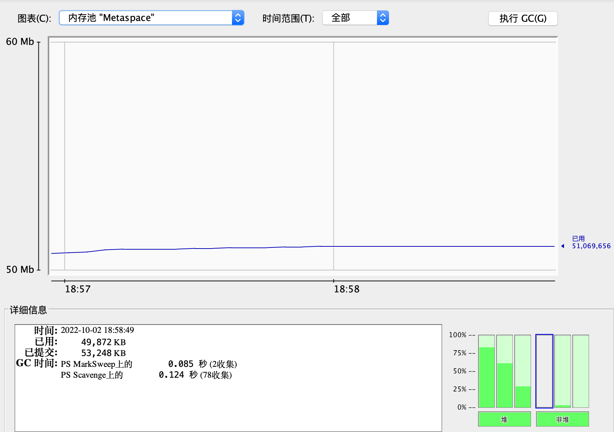

###### Class数量情况

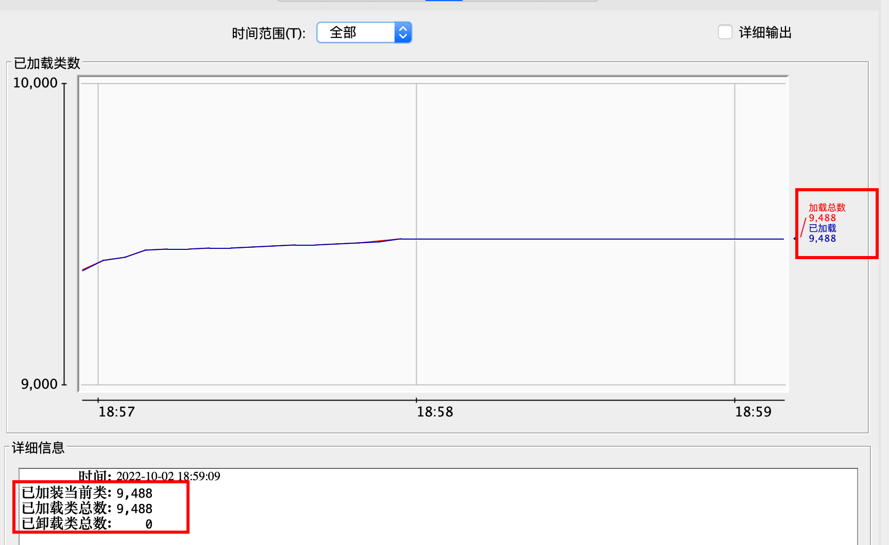

##### 2、压测开始后方法区内存和Class个数情况

###### 压测时方法区内存情况

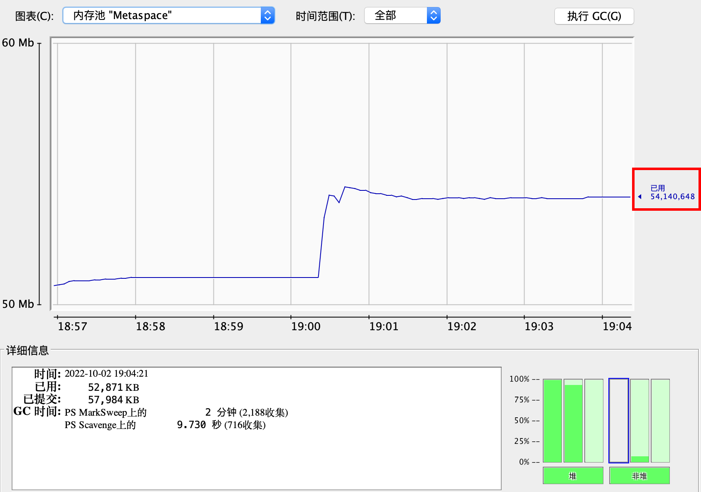


###### 压测时Class个数情况

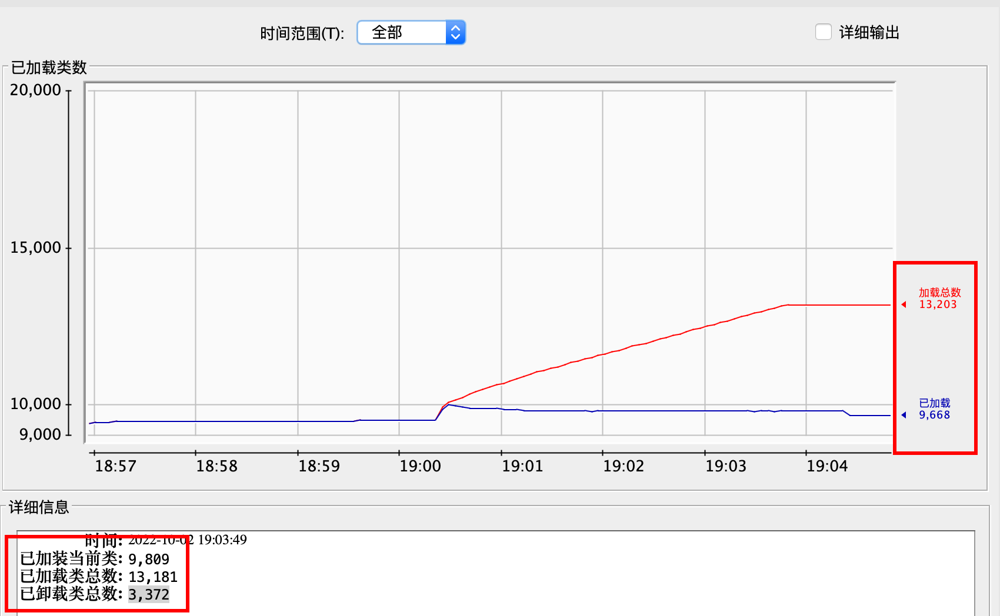

#### ③、总结

- 可以看到即使每次脚本都使用同一个【`GroovyClassLoader`】来加载，那么也不会导致方法区Class无法被回收的情况，只是方法区的Class数量会不断的增加，但是当这些Class不在被使用了，这些Class是可以被回收的。
  - 为什么呢？参考：[用同一个GroovyClassLoader加载的Class真的无法回收吗](https://blog.csdn.net/Hellowenpan/article/details/127145821?csdn_share_tail=%7B%22type%22%3A%22blog%22%2C%22rType%22%3A%22article%22%2C%22rId%22%3A%22127145821%22%2C%22source%22%3A%22Hellowenpan%22%7D)
- 只是如果每次执行脚本都通过ClassLoader进行加载为Class然后再执行的话，未免效率太低，并且也会造成方法区不断的加载和卸载Class，增加系统负担，最好别这么做。


