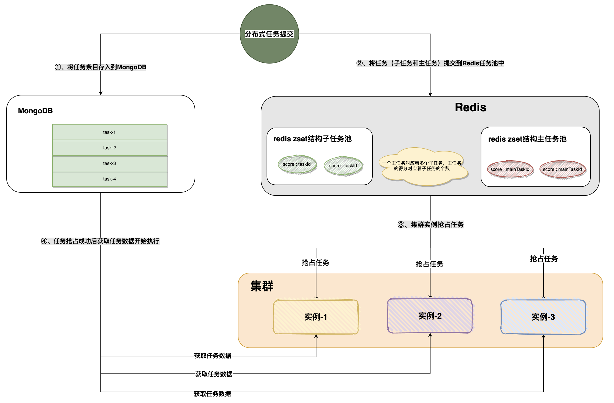

## 一、分布式任务设计架构图




## 二、如何使用

### 1、依赖引入

#### ①、下载项目，打包到maven仓库

```
mvn clean install
```

#### ②、pom文件中引入依赖

```xml
<dependency>
    <groupId>org.basis.enhance</groupId>
    <artifactId>enhance-distribute-executor</artifactId>
    <version>1.0-SNAPSHOT</version>
</dependency>
```

### 2、配置

分布式任务执行器需要依赖于MongoDB和Redis作为中间件，所以需要引入配置Redis和MongoDB配置。

```yml
spring:
  application:
    name: enhance-executor-test
  # Redis配置
  redis:
    host: ${SPRING_REDIS_HOST:wenpan-host}
    port: ${SPRING_REDIS_PORT:6379}
    password: ${SPRING_REDIS_PASSWORD:WenPan@123}
    database: ${SPRING_REDIS_DATABASE:1}
    client-type: lettuce
    lettuce:
      pool:
        max-active: ${SPRING_REDIS_POOL_MAX_ACTIVE:16}
        max-idle: ${SPRING_REDIS_POOL_MAX_IDLE:16}
        max-wait: ${SPRING_REDIS_POOL_MAX_WAIT:5000}
        
  datasource:
    driver-class-name: com.mysql.jdbc.Driver
    url: ${SPRING_DATASOURCE_URL:jdbc:mysql://wenpan-host:3306/stone_project?useUnicode=true&characterEncoding=UTF-8&useSSL=false}
    username: ${SPRING_DATASOURCE_USERNAME:root}
    password: ${SPRING_DATASOURCE_PASSWORD:wenpan}

  # MongoDB配置
  data:
    mongodb:
      uri: ${MONGODB_DEFAULT_URL:mongodb://localhost:27017/admin}

# 分布式任务配置
stone:
  executor:
    enable: true
    group: executor-test-group
    task-lock-expire-seconds: 60
    # 如果没有任务则休息多少秒再去拉取
    polling-frequency-millis: 5000
    max-task-count: 1
    lost-threshold: 4
```

### 3、使用

#### ①、构建任务

```java
public String get(String data) {

    // 通过任务客户端构建要执行的分布式任务
    MainTask mainTask = taskClient.createMainTask();
    Task.Builder builder = new Task.Builder();
    builder.isIdempotent(Boolean.FALSE);
    // 指定beanID
    builder.taskHandlerBeanId("testTaskHandler");
    builder.data(data);
    builder.title("task-name");
    mainTask.addSubTask(builder.build());

    // 提交任务到任务池
    MainTaskResult taskResult = mainTask.submit();
    // 阻塞等待分布式任务执行
    taskResult.waitTaskFinished(5, TimeUnit.SECONDS);

    return "success";
}
```

#### ②、编写分布式任务处理方法

```java
@Slf4j
@Component("testTaskHandler")
public class TestTaskHandler implements TaskHandler<String> {

    @Override
    public void handler(String data) {
      	// 执行任务.....
        log.info("收到分布式任务数据,data = {}", data);
    }
}
```


